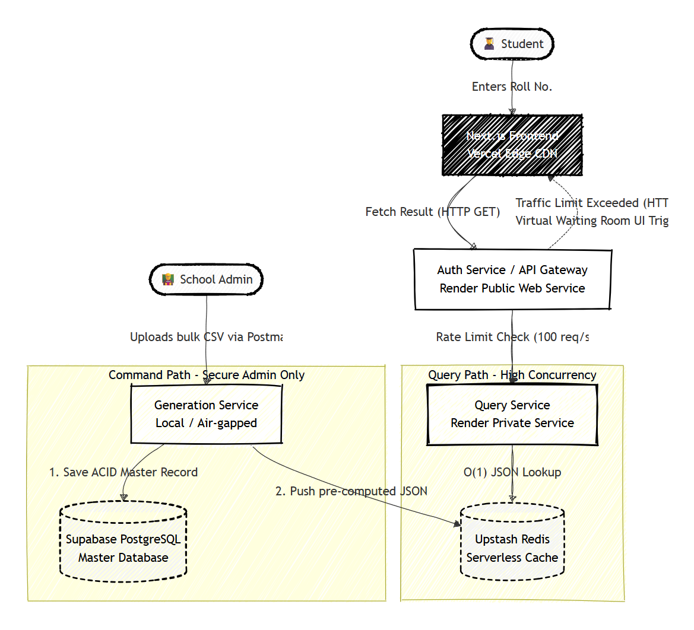

# ExamPortal.

A high-concurrency, distributed microservice architecture designed to solve the "Thundering Herd" problem during national/university examination result declarations.

## Project Overview

During result days, traditional monolithic university portals frequently crash due to database deadlocks caused by millions of simultaneous read requests.

This project implements the Command Query Responsibility Segregation (CQRS) pattern alongside an Edge-Cached API Gateway to achieve zero-downtime performance. By completely isolating read traffic from the master relational database and routing it through an O(1) in-memory Redis cluster, the system can handle massive traffic spikes gracefully.

### Key Features

- CQRS Architecture: Strict separation of data ingestion (Command) and data retrieval (Query).

- Virtual Waiting Room: An API Gateway backed by a Token Bucket algorithm that intercepts excess traffic and places users in a queue rather than dropping their connections.

- Neominimalist UI: A highly responsive, brutalist-inspired frontend built with Next.js and Tailwind CSS (Space Grotesk & JetBrains Mono typography).

- Printable Mark Sheets: Client-side generation of high-resolution, downloadable PDF certificates using html-to-image and jspdf.

- Stateless Cloud Design: Built entirely on Serverless/PaaS infrastructure (Vercel, Render, Upstash, Supabase).

## System Architecture

## 🛠️ Technology Stack

| Component            | Technology Used                | Purpose                                                    |
| -------------------- | ------------------------------ | ---------------------------------------------------------- |
| **Frontend UI**      | Next.js 14, React, Tailwind v4 | Edge-delivered static generation & client interactions.    |
| **Microservices**    | Node.js, Express, TypeScript   | Lightweight, containerized API endpoints.                  |
| **Master Database**  | PostgreSQL (Supabase)          | ACID-compliant storage of truth for student records.       |
| **In-Memory Cache**  | Redis (Upstash)                | Sub-millisecond latency JSON retrieval for the Query path. |
| **Rate Limiting**    | @upstash/ratelimit             | Token bucket algorithm to prevent DDoS/Traffic spikes.     |
| **Containerization** | Docker & Docker Compose        | Ensuring parity between local dev and cloud deployments.   |

## ☁️ Cloud Deployment Notes

- Frontend: Deployed via Vercel. Set the Root Directory to the frontend folder.

- Auth & Query Services: Containerized and deployed as Web Services on Render.

- Generation Service: Maintained exclusively on localhost (air-gapped) for security purposes; writes directly to cloud databases.
